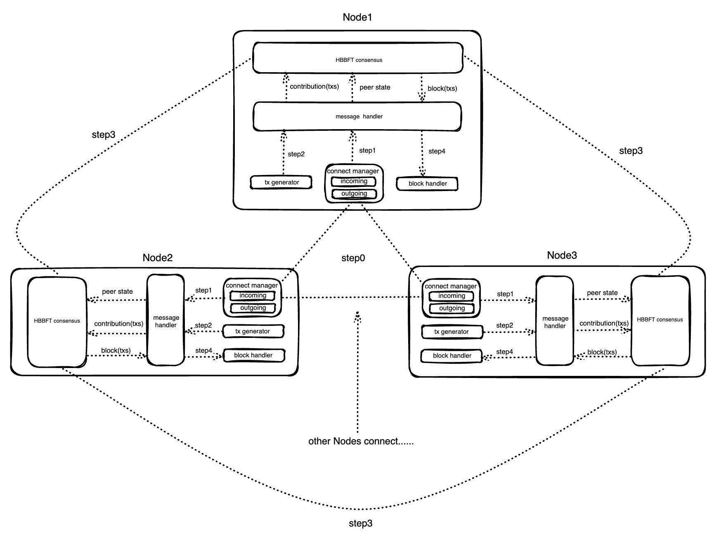

# HBBFT-Node

This is a benchmark testing framework based on the HBBFT(HoneyBadger BFT) consensus algorithm.

## BackGround

Async Byzantine Fault Tolerance consensus was first originated from Andrew Miller et al.'s HBBFT consensus algorithm. In recent years, many variant algorithms based on HBBFT have emerged. However, there is no open-source and universal testing framework to measure the performance indicators of these algorithms. Based on this, we developed an asynchronous consensus testing framework to measure the performance of HBBFT and its variant algorithms under different parameter indicators.

Now, we have implemented a testing framework based on the HBBFT consensus algorithm. The framework is tested based on the [HBBFT](https://github.com/poanetwork/hbbft) algorithm library developed by POA.

## HBBFT network architecture



### Modules
As shown in the figure above, each node contains the following modules:
* **Connect Manager**: Manages the network connections between nodes.
* **Transaction Generator**: Generates random normal transactions.
* **Message Manager**: Handles node status messages (from observer to validator) and normal transaction messages.
* **HBBFT Consensus**: The HBBFT consensus module is responsible for consensus processing of node status messages and normal user transactions, and generates blocks.
* **Block Handler**: Processes the generated block data to obtain test data. 

### Communication flow

In a multi-node HBBFT network, communication mainly involves the following processes:

* **Step 0**: When a node starts up, it needs to specify its own communication port and the communication ports of multiple remote nodes that it needs to connect to. Once the node starts, it will establish connections to these ports through the `Connect Manager` module. Eventually, all nodes will be connected to each other to form an HBBFT network.

* **Step 1**: When the HBBFT network reaches a sufficient number of nodes (the minimum number of nodes required to start a BFT network, such as 3), the nodes will start a `DKG` algorithm instance to generate threshold keys (these keys will be used for subsequent threshold encryption and signature, which is one of the most important features of HBBFT). At the same time, the state of these nodes will transition to `validator` (like most blockchain systems, validators are responsible for HBBFT consensus and block production). Node status messages will be sent to the `Message Manager` as a `wire message` for processing. Finally, the local node will record these states, while updating the validator view of the network for subsequent consensus communication between nodes.

* **Step 2**: When a node is a validator, it will generate some random normal transactions (simulating transactions sent by clients) through the `Transaction Generator`. A `contribution` will be generated once per `epoch`, and these transactions will be used as input for HBBFT consensus.

* **Step 3**: After all nodes locally input the contribution as the input of `HBBFT Consensus`, they will enter the consensus phase. This process involves multiple rounds of communication between nodes, mainly through `RBC (Reliable Broadcast)` and `ABA (Async Binary Agreement)`. For detailed consensus process, please refer to: [The Honey Badger of BFT Protocols](https://eprint.iacr.org/2016/199.pdf).

* **Step 4**: After all nodes reach consensus, the consensus result (`block/batch output`) will be generated locally, and the local `Block Handler` will parse the block data as test results when it receives it. 

## Minimal HBBFT network example
> This section mainly provides a minimal practice for launching a multi-node HBBFT network. You can intuitively understand the communication between nodes through this example.
open three terminal and run this command separately.
```
./hbd.sh 1
./hbd.sh 2
./hbd.sh 3
```
you can see the info in terminal like this:
```
2023-04-23T18:22:18 [INFO]: 
2023-04-23T18:22:18 [INFO]: Local HBBFT Node: 
2023-04-23T18:22:18 [INFO]:     UID:             0f3e80d2-5aa1-45e0-b58e-39124ddab2f3
2023-04-23T18:22:18 [INFO]:     Socket Address:  [::1]:3003
2023-04-23T18:22:18 [INFO]:     Public Key:      PublicKey(084d..c71e)
2023-04-23T18:22:18 [INFO]: 
2023-04-23T18:22:18 [INFO]: ****** Hello, You are starting a hbbft node! ******
2023-04-23T18:22:18 [INFO]: 
2023-04-23T18:22:18 [INFO]: Listening on: InAddr([::1]:3003)
2023-04-23T18:22:18 [INFO]: Initiating outgoing connection to: 127.0.0.1:3004
2023-04-23T18:22:18 [INFO]: Initiating outgoing connection to: 127.0.0.1:3002
2023-04-23T18:22:18 [INFO]: Initiating outgoing connection to: [::1]:3004
2023-04-23T18:22:18 [INFO]: Initiating outgoing connection to: [::1]:3002
2023-04-23T18:22:18 [INFO]: Current Node Role State: Disconnected(connect with 0 peer nodes)
2023-04-23T18:22:18 [INFO]:     Peers: []
2023-04-23T18:22:18 [WARN]: Unable to connect to: 127.0.0.1:3004 (Io(Os { code: 61, kind: ConnectionRefused, message: "Connection refused" }): Io error: Connection refused (os error 61))
2023-04-23T18:22:18 [WARN]: Unable to connect to: [::1]:3004 (Io(Os { code: 61, kind: ConnectionRefused, message: "Connection refused" }): Io error: Connection refused (os error 61))
2023-04-23T18:22:18 [WARN]: Unable to connect to: 127.0.0.1:3002 (Io(Os { code: 61, kind: ConnectionRefused, message: "Connection refused" }): Io error: Connection refused (os error 61))
2023-04-23T18:22:18 [INFO]: Setting state: `DeterminingNetworkState`.
2023-04-23T18:22:18 [INFO]: State has been set from 'Disconnected' to 'DeterminingNetworkState'.
2023-04-23T18:22:18 [INFO]: Setting state: `KeyGen`.
2023-04-23T18:22:18 [INFO]: State has been set from 'DeterminingNetworkState' to 'KeyGen'.
2023-04-23T18:22:18 [INFO]: Initiating outgoing connection to: [::1]:3001
2023-04-23T18:22:18 [INFO]: BEGINNING KEY GENERATION
2023-04-23T18:22:18 [INFO]: KEY GENERATION: All acks received and handled.
2023-04-23T18:22:18 [INFO]: == INSTANTIATING HONEY BADGER ==
2023-04-23T18:22:18 [INFO]: 
2023-04-23T18:22:18 [INFO]: == HONEY BADGER INITIALIZED ==
2023-04-23T18:22:18 [INFO]: 
2023-04-23T18:22:18 [INFO]: 
2023-04-23T18:22:18 [INFO]: 
2023-04-23T18:22:18 [INFO]: PUBLIC KEY: PublicKey(011f..003e)
2023-04-23T18:22:18 [INFO]: PUBLIC KEY SET: 
PublicKeySet { commit: Commitment { coeff: [G1 { x: Fq(FqRepr([12624710051720135447, 16214640512019675234, 5375594208134825685, 6823382988583783202, 13080901014927615225, 569714124389320140])), y: Fq(FqRepr([5911186384159746551, 9389157046853635757, 16823177490184965484, 18161003260290786161, 18021883552539075193, 207359160449102030])), z: Fq(FqRepr([2867636602762150335, 2890408934827664422, 6730933303003462929, 7610772776916375624, 6570248350391488715, 1151467518298163389])) }] } }
2023-04-23T18:22:18 [INFO]: PUBLIC KEY MAP: 
{0f3e80d2-5aa1-45e0-b58e-39124ddab2f3: PublicKey(084d..c71e), 281ccfaa-c3f9-44f9-ae7a-f8ece5dc0fc3: PublicKey(117e..a18d), c4f6cf47-6716-493b-9269-01a9e04efd94: PublicKey(0596..736a)}
2023-04-23T18:22:18 [INFO]: 
2023-04-23T18:22:18 [INFO]: 
2023-04-23T18:22:18 [INFO]: State has been set from 'KeyGen' to 'Validator'.
2023-04-23T18:22:23 [INFO]: Current Node Role State: Validator(connect with 2 peer nodes)
2023-04-23T18:22:23 [INFO]:     Peers: ["[::1]:3001", "[::1]:3002"]
2023-04-23T18:22:23 [INFO]: Generating and sending 5 random transactions...
```

If you want to start with more node, you can open more terminal and see the log, such as:
```
./hbd.sh 4
```

## Benchmark testing of HBBFT

To more accurately and realistically test the performance of the HBBFT consensus algorithm under various conditions, we use Docker containers to simulate communication between nodes and manage the configuration and startup of multiple nodes through docker-compose.

> Using Docker to simulate consensus nodes has many advantages:
> 1. Isolated environment: Docker can create isolated container environments, and each container is isolated from each other. This can avoid interference and conflicts between nodes, making it possible to more realistically simulate the node environment.
> 2. Easy deployment: Docker can quickly deploy and start containers, which can greatly reduce the deployment and configuration time of consensus nodes.
> 3. Lightweight: Docker containers are more lightweight and can run multiple containers simultaneously on the same machine, which can simulate communication between multiple consensus nodes.
> 4. Easy to manage: Docker can easily start, stop, restart, delete, and other operations on containers. The configuration of Docker containers is also more convenient.

The performance of a consensus algorithm is influenced by multiple factors, such as:

* Node bandwidth (bandwidth limits the amount of data that a node can communicate within a certain time frame)
* Network latency (HBBFT is different from other consensus algorithms as it involves multiple rounds of communication among consensus nodes, so network latency is an important metric for HBBFT)
* Block size (a metric that affects TPS)
* Number of Crashed nodes
* Number of Byzantine nodes
* Network performance under different hardware conditions (whether some nodes with lower hardware configurations will affect the overall consensus performance) 


### start Basic hbbft network with docker

**1. Build your docker image**  
software and hardware environment of host machine:  
* os: ubuntu22.04
* cpu: >=8核心  
* memory: >=8GB

> Note that the base image built in our Dockerfile is Ubuntu. If your operating system is different from here, you can replace the base image as needed.

Go to the `scripts` directory under the `HBBFT-NODE` directory, and then execute
```shell
./build.sh
```
After executed, run:
```shell
docker images
```
If you can see a built image, it means the build was successful.
```
hbbft-node              latest             2dab66d3b66a   8 seconds ago   170MB
```

**2. start hbbft network with 4 nodes with docker**   

We use docker-compose to configure and start multiple Docker nodes, ensuring that all nodes have the same resource utilization (such as CPU, memory, etc.). Execute the following command under the `HBBFT-Node` directory:

```
TXN_GEN_COUNT=1000 TXN_BYTES=100 BAND_WIDTH=2 docker-compose up node1 node2 node3 node4
```
You can see the startup logs of multiple nodes in the terminal. Under normal circumstances, block production will start in about 1 minute. Please observe the log output in the terminal carefully.

If you want to export the test data of each node, you can open another terminal, go to the scripts directory, and execute:
```
./export_data.sh
```
This will export the test results of each container node to the `test-data` directory under the scripts directory.
After successful execution, you will see a test_data file in the scripts directory, which contains the test data of 4 HBBFT nodes (displayed in Markdown format). Here is an example of the test data statistics for one of the nodes:

 | epoch_id | validator num | contributor num | tx num of contribution | tx size(Bytes)/tx | tx num of block  | epoch_time(latency) |
|:-------:|:-------:|:-------:|:-------:|:-------:|:-------:|:-------:|
| 0 | 3 | 3 | 1000 | 100 | 3000 | 7.055627785 |
| 1 | 4 | 3 | 1000 | 100 | 3000 | 6.946789112 |
| 2 | 4 | 3 | 1000 | 100 | 3000 | 7.139002012 |
| 3 | 4 | 3 | 1000 | 100 | 3000 | 7.749101023 |
| 4 | 4 | 4 | 1000 | 100 | 4000 | 8.810287422 |
| 5 | 4 | 4 | 1000 | 100 | 4000 | 9.072991329 |
| 6 | 4 | 4 | 1000 | 100 | 4000 | 8.93126885 |
| 7 | 4 | 4 | 1000 | 100 | 4000 | 8.758018687 |
| 8 | 4 | 4 | 1000 | 100 | 4000 | 9.064333954 |
| 9 | 4 | 4 | 1000 | 100 | 4000 | 8.815384505 |
| 10 | 4 | 4 | 1000 | 100 | 4000 | 8.792603817 |
| 11 | 4 | 4 | 1000 | 100 | 4000 | 8.785026706 |
| 12 | 4 | 4 | 1000 | 100 | 4000 | 8.793585703 |

The test data results include:
- epoch_id
- validator number and contributor number of each epoch
- transaction number of contribution of each node
- transaction size of per transaction
- transaction number of block of each
- epoch time(transaction latency)


### Advanced configurable testing strategies
> Above, we only started a minimal HBBFT cluster network using Docker and exported the test data of the nodes. However, in actual testing, we need to consider multiple metrics that affect consensus. To measure the impact of these metrics on the consensus results, we need to make these metrics configurable (such as bandwidth, latency, etc.) to obtain test data for consensus under different configurations for comparative analysis. From this point on, we will test with a minimum of 5 nodes.

In the `scripts` directory, we can use `start.sh` to configure the container nodes. By executing this shell file, you will see that the script provides several parameter options.
```shell
ubuntu:~/HBBFT-Node/scripts$ ./start.sh
```
**parameter options**：
```
Usage: ./start.sh <nodes_number> [delay_between_nodes_in_seconds] [txn_gen_count] [txn_bytes] [band_width]
```
**parameter settings**：  
* `nodes_number`: the number of nodes to start (we only wrote 7 nodes in the docker-compose file, but there is no limit to this. If your machine performance is better, you can increase the number of nodes)
* `delay_between_nodes_in_seconds`: the interval time between starting the next node after starting 4 nodes (we recommend an interval time of >=30s)
* `txn_gen_count`: the number of transactions generated by each node
* `txn_bytes`: the size of each transaction in bytes
* `band_width`: the bandwidth setting for each Docker container (this setting needs to be estimated based on the number of transactions, transaction size, and number of nodes)


**Test Case1**:  
The above parameters will all affect the consensus results, so we need to use the method of controlling variables to determine the impact of a certain metric on consensus. For example, if we want to test the relationship between block size and TPS (transactions per second), we can only change `txn_gen_count` and `txn_bytes`, and keep all other parameters consistent (other node configurations are not limited), and compare and analyze the TPS under different block sizes. Here is an example:

* **7** nodes are started, with each node having **100** transaction of each contribution, each transaction size being **200** Bytes, and each node having a bandwidth of **4** Mbit.
```
./start.sh 7 30 100 200 4
```
> After all Docker containers are started, we can wait for a period of time to allow all nodes to go through multiple consensus processes. This way, we can obtain more test data. We will follow this method for the subsequent tests.

 | epoch_id | validator num | contributor num | batch num | tx size(Bytes)/tx | block num | epoch_time(latency) |
|:-------:|:-------:|:-------:|:-------:|:-------:|:-------:|:-------:|
| 0 | 3 | 3 | 100 | 200 | 300 | 6.382321751 |
| 1 | 4 | 3 | 100 | 200 | 300 | 5.4075059549999995 |
| 2 | 4 | 3 | 100 | 200 | 300 | 5.611927254 |
| 3 | 4 | 3 | 100 | 200 | 300 | 6.152392536 |
| 4 | 4 | 3 | 100 | 200 | 300 | 5.616918948 |
| 5 | 4 | 4 | 100 | 200 | 400 | 5.503100793 |
| 6 | 5 | 4 | 100 | 200 | 400 | 5.667346645 |
| 7 | 5 | 4 | 100 | 200 | 400 | 5.921122342 |
| 8 | 5 | 4 | 100 | 200 | 400 | 6.516872889 |
| 9 | 5 | 4 | 100 | 200 | 400 | 7.900381465 |
| 10 | 5 | 5 | 100 | 200 | 500 | 5.984451347 |
| 11 | 6 | 5 | 100 | 200 | 500 | 6.322684681 |
| 12 | 6 | 5 | 100 | 200 | 500 | 6.852044098 |
| 13 | 6 | 5 | 100 | 200 | 500 | 9.897500685 |
| 14 | 6 | 6 | 100 | 200 | 600 | 6.3251246420000005 |
| 15 | 7 | 6 | 100 | 200 | 600 | 6.586881373 |
| 16 | 7 | 6 | 100 | 200 | 600 | 6.925262886 |
| 17 | 7 | 6 | 100 | 200 | 600 | 7.832040629 |
| 18 | 7 | 6 | 100 | 200 | 600 | 13.157394791 |
| 19 | 7 | 7 | 100 | 200 | 700 | 7.109984798 |
| 20 | 7 | 7 | 100 | 200 | 700 | 7.131442204 |

* **7** nodes are started, with each node having **500** transaction of each contribution, each transaction size being **200** Bytes, and each node having a bandwidth of **4** Mbit.

```
./start.sh 7 30 500 200 4
```
 | epoch_id | validator num | contributor num | batch num | tx size(Bytes)/tx | block num | epoch_time(latency) |
|:-------:|:-------:|:-------:|:-------:|:-------:|:-------:|:-------:|
| 0 | 3 | 3 | 500 | 200 | 1500 | 6.828630519 |
| 1 | 4 | 3 | 500 | 200 | 1500 | 6.043940672 |
| 2 | 4 | 3 | 500 | 200 | 1500 | 6.275685817 |
| 3 | 4 | 3 | 500 | 200 | 1500 | 6.781096385 |
| 4 | 4 | 4 | 500 | 200 | 2000 | 6.95155244 |
| 5 | 4 | 4 | 500 | 200 | 2000 | 6.938567927 |
| 6 | 5 | 4 | 500 | 200 | 2000 | 7.707628227 |
| 7 | 5 | 4 | 500 | 200 | 2000 | 8.210157224 |
| 8 | 5 | 4 | 500 | 200 | 2000 | 9.640333519 |
| 9 | 6 | 5 | 500 | 200 | 2500 | 7.407868083 |
| 10 | 6 | 5 | 500 | 200 | 2500 | 8.509376067 |
| 11 | 6 | 4 | 500 | 200 | 2000 | 8.755158511 |
| 12 | 6 | 5 | 500 | 200 | 2500 | 12.242061789 |
| 13 | 7 | 6 | 500 | 200 | 3000 | 8.667817633 |
| 14 | 7 | 6 | 500 | 200 | 3000 | 10.051480464 |
| 15 | 7 | 6 | 500 | 200 | 3000 | 15.556938594 |
| 16 | 7 | 7 | 500 | 200 | 3500 | 10.014456435 |
| 17 | 7 | 7 | 500 | 200 | 3500 | 10.220635978 |
| 18 | 7 | 7 | 500 | 200 | 3500 | 10.227373999 |
| 19 | 7 | 6 | 500 | 200 | 3000 | 10.164813805 |
| 20 | 7 | 7 | 500 | 200 | 3500 | 10.331292696 |

* **7** nodes are started, with each node having **1000** transaction of each contribution, each transaction size being **200** Bytes, and each node having a bandwidth of **4** Mbit.
```
./start.sh 7 30 1000 200 4
```
 | epoch_id | validator num | contributor num | batch num | tx size(Bytes)/tx | block num | epoch_time(latency) |
|:-------:|:-------:|:-------:|:-------:|:-------:|:-------:|:-------:|
| 0 | 3 | 3 | 1000 | 200 | 3000 | 6.966154583 |
| 1 | 4 | 3 | 1000 | 200 | 3000 | 6.91688182 |
| 2 | 4 | 3 | 1000 | 200 | 3000 | 7.138704897 |
| 3 | 4 | 3 | 1000 | 200 | 3000 | 7.662942831 |
| 4 | 4 | 3 | 1000 | 200 | 3000 | 8.076396219 |
| 5 | 5 | 4 | 1000 | 200 | 4000 | 9.620888361 |
| 6 | 5 | 4 | 1000 | 200 | 4000 | 10.069167967 |
| 7 | 5 | 4 | 1000 | 200 | 4000 | 11.839249859 |
| 8 | 6 | 5 | 1000 | 200 | 5000 | 9.878097428 |
| 9 | 6 | 5 | 1000 | 200 | 5000 | 10.667463199 |
| 10 | 6 | 5 | 1000 | 200 | 5000 | 13.711930982 |
| 11 | 7 | 6 | 1000 | 200 | 6000 | 10.693320989 |
| 12 | 7 | 6 | 1000 | 200 | 6000 | 11.589053879 |
| 13 | 7 | 6 | 1000 | 200 | 6000 | 16.987185506 |
| 14 | 7 | 7 | 1000 | 200 | 7000 | 13.576185254 |
| 15 | 7 | 7 | 1000 | 200 | 7000 | 13.560742354 |
| 16 | 7 | 7 | 1000 | 200 | 7000 | 13.283867946 |
| 17 | 7 | 7 | 1000 | 200 | 7000 | 13.666459602 |
| 18 | 7 | 7 | 1000 | 200 | 7000 | 13.595313426 |
| 19 | 7 | 7 | 1000 | 200 | 7000 | 13.294529275 |
| 20 | 7 | 7 | 1000 | 200 | 7000 | 13.810295315 |


**Test Case2**:  
We also provide a script for setting the Docker container delay, which is used to simulate the testing performance of HBBFT consensus under different delay environments. For example, we simulate the performance of **7** nodes in the network (each node generates **500** transactions, each transaction is **20** Bytes, and the node bandwidth is **8** Mbits) under different network delays:

* Make sure all nodes are started under the same configuration.
* Wait for all nodes to become validators and stabilize block production.
* Set the network delay for all nodes.


1. start all nodes
```
./start.sh 7 30 500 20 8
```

2. set network latency of all nodes with 100ms
```
./set_latency.sh 7 100
```
> Usage: ./set_latency.sh <nodes_number> [delay_ms]

2. set network latency of all nodes with 200ms
```
./set_latency.sh 7 200
```

3. set network latency of all nodes with 100ms
```
./set_latency.sh 7 300
```

**More test case**  
If you want to try more test cases, you can customize them based on the above test scripts to obtain the desired test result data.

## Benchmark testing of HBBFT variant algorithms
TODO...